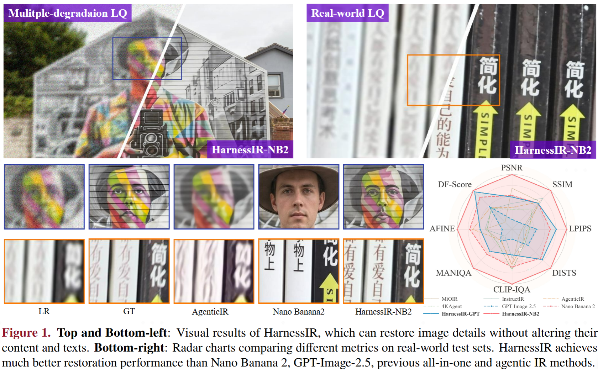
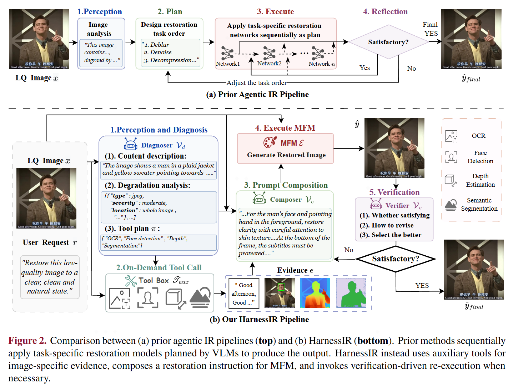
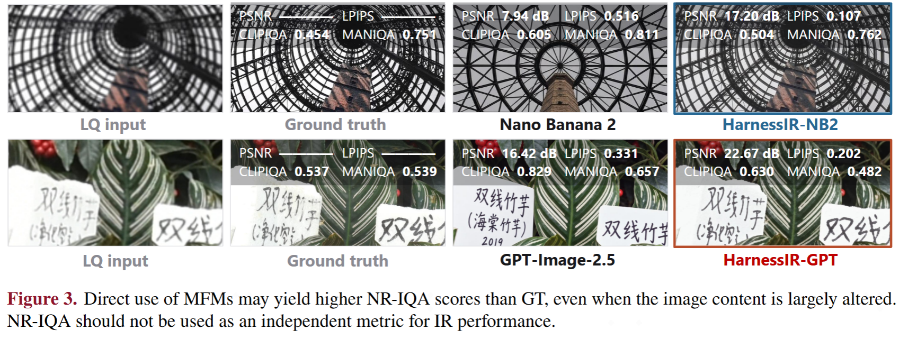
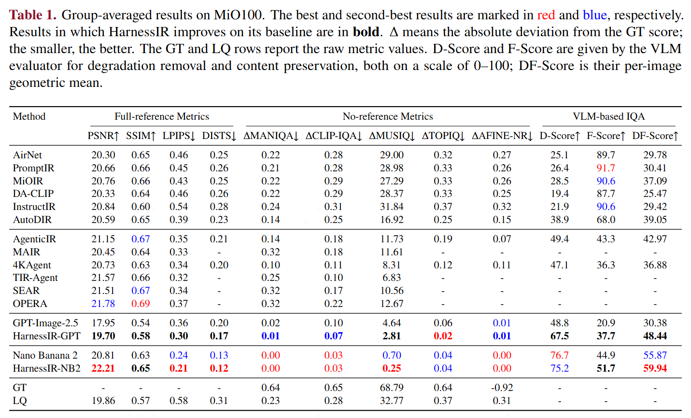
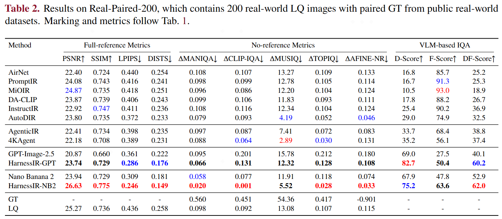
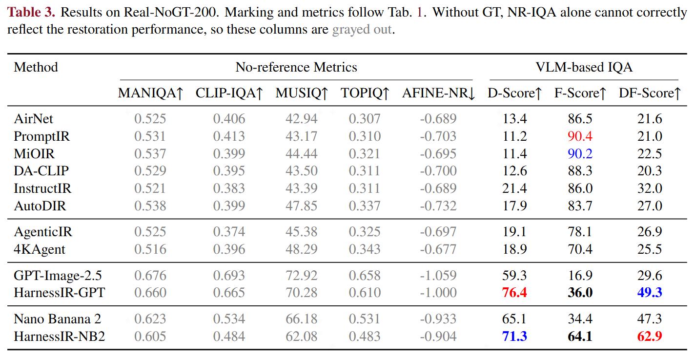
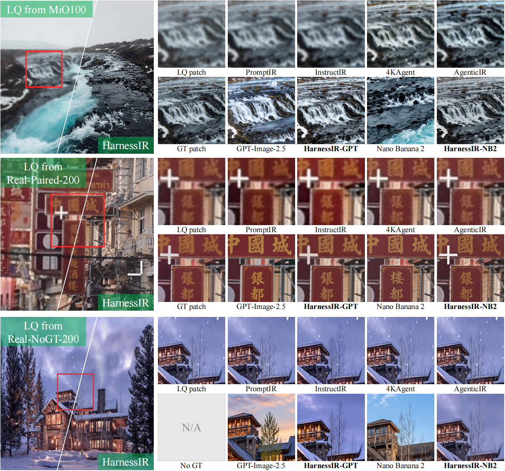
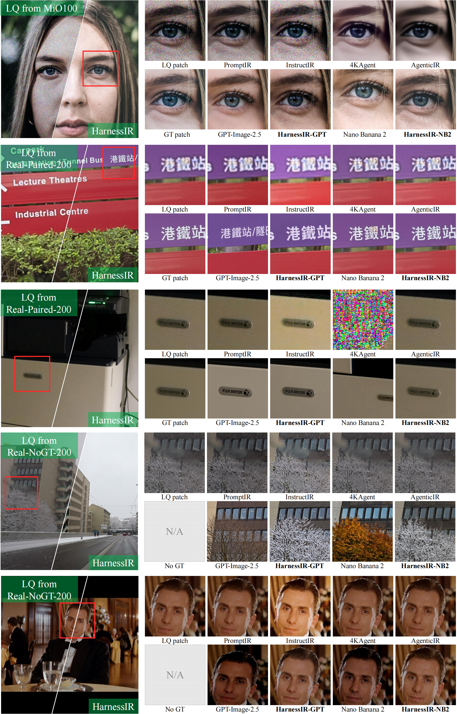

<div align="center">

# HarnessIR: Harnessing Multimodal Foundation Models for Universal Real-World Image Restoration

<p align="center"><i>Restoration by harnessing an MFM executor, not by scheduling restoration tools.</i></p>

[](https://arxiv.org/abs/TODO)
[](https://huggingface.co/datasets/VCLab-PolyU/HarnessIR/tree/main)
[](https://pan.baidu.com/s/1CIGdo-hMLsedI-Q0yUT-Iw?pwd=ngjt)
[](https://polyu-vclab.github.io/HarnessIR/)

[Xiangtao Kong](https://scholar.google.com/citations?user=lueNzSgAAAAJ)<sup>1,2</sup> |
[Shuaizheng Liu](https://scholar.google.com/citations?user=wzdCc-QAAAAJ)<sup>1,2</sup> |
[Rongyuan Wu](https://scholar.google.com/citations?user=A-U8zE8AAAAJ)<sup>1,2</sup> |
[Lingchen Sun](https://scholar.google.com/citations?user=ZCDjTn8AAAAJ)<sup>1,2</sup> |
[Zhengqiang Zhang](https://scholar.google.com/citations?user=UX26wSMAAAAJ)<sup>1,2</sup> |
[Jinxin Zhao](https://scholar.google.com/citations?user=0Z89rfUAAAAJ)<sup>1,2</sup> |
[Yuhui Wu](https://scholar.google.com/citations?user=Qt4WlSkAAAAJ)<sup>1,2</sup> |
[Lei Zhang](https://www4.comp.polyu.edu.hk/~cslzhang/)<sup>1,2,&dagger;</sup>

<sup>1</sup> The Hong Kong Polytechnic University  
<sup>2</sup> OPPO Research Institute

<sup>&dagger;</sup> Corresponding author.

</div>

<p align="center">
  
</p>

## &#x1F4CC; Quick Links

- [&#x1F4F0; News](#news)
- [&#x1F9F0; HarnessIR](#method)
- [&#x1F4CA; Evaluation Protocol and Metrics](#evaluation)
- [&#x1F5BC;&#xFE0F; Experimental Results](#results)
- [&#x1F50D; Visual Results](#visual)
- [&#x1F3CB;&#xFE0F; Deployment](#deployment)
- [&#x1F4EE; Contact](#contact)
- [&#x1F4DA; Citation](#citation)

<a id="news"></a>
## &#x1F4F0; News

- **2026-10-07**: Released the code, benchmark and visual results of HarnessIR.

---

<a id="method"></a>
## &#x1F9F0; HarnessIR

<p align="center">
  
</p>

<details>
<summary><strong>Click to expand the pipeline description</strong></summary>

<br>

Prior agentic IR methods apply task-specific restoration models in sequence, and are therefore bounded by those tools. HarnessIR keeps **one MFM as the executor** and varies only the prompt it is given. Five stages:

1. **Perception and diagnosis** &mdash; a VLM reads the content and its degradations, and names which auxiliary tools to consult.
2. **On-demand tool invocation** &mdash; only the planned tools run, returning image-specific evidence.
3. **Prompt composition** &mdash; the evidence is composed into one prompt stating what to treat and what must survive untouched.
4. **Execution** &mdash; the MFM receives the original LQ image and that prompt, in a single pass.
5. **Verification-driven refinement** &mdash; the result is judged against the restoration requirements, and re-executed **from the original LQ input** only when it fails.

Two choices distinguish it from prior pipelines: **no restoration tool is scheduled** (the auxiliary tools supply evidence for writing the prompt, not links in a restoration chain), and **the executor sees only the image and text** (diagnostic maps inform the prompt writer but are never passed to the editor, which would otherwise copy their colours into the output). HarnessIR is **inference-only**.

</details>

---

<a id="evaluation"></a>
## &#x1F4CA; Evaluation Protocol and Metrics

<details>
<summary><strong>Click to expand the evaluation protocol</strong></summary>

<br>

Fidelity is measured with full-reference metrics (PSNR, SSIM, LPIPS, DISTS) and image quality with no-reference metrics (MANIQA, CLIP-IQA, MUSIQ, TOPIQ, AFINE-NR).

A higher NR-IQA score does not by itself indicate better restoration: a model that repaints text or fabricates structure can still outscore its own ground truth. We therefore also report an independent VLM evaluator, giving **D-Score** for degradation removal and **F-Score** for content preservation (both 0&ndash;100), combined as their per-image geometric mean, **DF-Score** &mdash; taken per image and then averaged, so one image's strong D-Score cannot offset another image's broken F-Score:

$$\mathrm{DF\text{-}Score} = \frac{1}{N}\sum_{i=1}^{N}\sqrt{D_i \cdot F_i}$$

The evaluator's criteria come from each image's degradation type, never from the prompt the method was given: a method must not be able to change the yardstick by changing what it asks for.

<p align="center">
  
</p>

</details>

---

<a id="results"></a>
## &#x1F5BC;&#xFE0F; Experimental Results

<details>
<summary><strong>Click to expand experimental results</strong></summary>

<br>

HarnessIR is evaluated with two executors under the identical harness &mdash; **Nano Banana 2 (NB2)** and **GPT-Image-2.5-Sunburst** &mdash; against their direct-use baselines, all-in-one restoration models, and prior agentic IR methods.

### MiO100

On the synthetic mixed-degradation benchmark, HarnessIR-NB2 and HarnessIR-GPT gain **+1.40** and **+1.75 dB** PSNR over their direct-use baselines, plus **+4.1** and **+18.1** DF-Score points, mainly through better content preservation.

<p align="center">
  
</p>

### Real-Paired-200

On real-world images with paired ground truth, HarnessIR-NB2 reaches **26.63 dB** PSNR and a DF-Score of **62.0**, while HarnessIR-GPT improves PSNR by **+2.87 dB** and lifts its DF-Score from 40.1 to **60.2**. Both exceed the previous best DF-Score of 38.8.

<p align="center">
  
</p>

### Real-NoGT-200

On real-world images without ground truth, HarnessIR yields DF-Scores of **62.9** for NB2 and **49.3** for GPT-Image-2.5, well above the best prior result of 32.0. NR-IQA alone cannot rank these methods, as it rewards hallucinated detail even when the content has been altered.

<p align="center">
  
</p>

</details>

---

<a id="visual"></a>
## &#x1F5BC;&#xFE0F; Visual Results

<p align="center">
  
</p>

<details>
<summary><strong>Click to expand more visual comparisons</strong></summary>

<br>

<p align="center">
  
</p>

</details>

---

<a id="deployment"></a>
## &#x1F3CB;&#xFE0F; Deployment

### Environment

```bash
pip install -r requirements.txt
```

### Configuration

**1. API endpoint and key.** `harness/settings.py` speaks the Gemini `generateContent` protocol:

```text
POST {API_BASE}/v1beta/models/{model}:generateContent
headers: {"Authorization": "Bearer <API_KEY>"}
```

Fill in `API_BASE` (origin only, no trailing path) and `API_KEY` there, or set the environment variables &mdash; the environment wins:

```bash
export HARNESS_API_BASE="https://<your-endpoint-host>"
export HARNESS_API_KEY="<your-api-key>"
```

Leaving both unset raises at client construction with the name of the variable to set, rather than failing later with an opaque HTTP error.

**2. Model ids.** Also in `harness/settings.py`:

```python
VLM_MODEL_NAME = "gemini-3.7-flash"      # the diagnoser / composer / verifier
MFM_GEMINI_ENDPOINTS = {                  # the executor
    "nb2": "gemini-3.1-flash-image-preview",
    "gpt-image-2.5": "gpt-image-2.5-sunburst",
}
```

Any model id the endpoint accepts works; these are the ones used in the paper.

**3. Tool weights.** Expected under `./checkpoints`, overridable with `HARNESS_CKPT_DIR`:

```text
checkpoints/
|-- sam3_semantic.pt                                      T4 segmentation (SAM 3)
|-- depth_anything_v2_base/model.safetensors              T3 depth (Depth-Anything-V2-Base)
|-- insightface/models/buffalo_l/det_10g.onnx             T2 faces (SCRFD)
`-- paddleocr/official_models/PP-OCRv6_medium_{det,rec}   T1 text (PP-OCRv6)
```

```bash
export HARNESS_CKPT_DIR=/path/to/weights
```

**4. Run parameters.** `configs/default.json` holds the defaults (executor, round count, metrics, worker count, geometry). `run_harness.py --config <file>` points at a different one, and the command-line flags override it. Each parameter is documented in the file and in `python run_harness.py --help`.

### Input format: manifest

All four entry points read the same manifest &mdash; a JSON array, or JSONL with one object per line:

```json
[
  {
    "lq": "/abs/path/to/input.png",
    "gt": "/abs/path/to/ground_truth.png",
    "type": ["haze"],
    "prompt": "Please remove the haze from the image."
  }
]
```

| Field | Required | Meaning |
| --- | --- | --- |
| `lq` | yes | the degraded input image |
| `gt` | no | ground truth; only the full-reference metrics need it |
| `type` | no | the degradation present in this image &mdash; what the restoration is asked to remove |
| `prompt` | no | the restoration request for this image; both paths take it as input |

A request may be written per image (`prompt`), or once for the whole run with `--intent`, which takes precedence.

### The four entry points

#### 1. `run_baseline.py` &mdash; direct use of the executor

Executes the manifest's own `prompt` field. No diagnosis, no tools, no prompt composition. This is the reference point the harness is measured against.

```bash
python run_baseline.py \
  --manifest manifest.json \
  --lq-root  /path/to/test-set \
  --out      runs/baseline
```

#### 2. `run_harness.py` &mdash; the full harness

Runs stages 1&ndash;4, and stage 5 with `--redo`.

```bash
python run_harness.py \
  --manifest manifest.json \
  --lq-root  /path/to/test-set \
  --out      runs/harness
```

Redo is **off by default**, which is the single-pass configuration.

#### 3. `compute_iqa.py` &mdash; fidelity and quality metrics

```bash
python compute_iqa.py --records runs/harness/record.json
```

Full-reference: PSNR, SSIM, LPIPS, DISTS. No-reference: MANIQA, CLIP-IQA, MUSIQ, TOPIQ, AFINE-NR. The full-reference metrics need a ground truth and are skipped without one.

#### 4. `compute_df.py` &mdash; D-Score, F-Score and DF-Score

```bash
python compute_df.py --records runs/harness/record.json --default-type mix
```

A VLM evaluator scores each (input, result) pair on two axes, 0&ndash;100: **D** for degradation removal and **F** for content fidelity, combined as their per-image geometric mean, **DF-Score**.

### Output layout

```text
runs/harness/
|-- config.json                  the configuration this run used
|-- record.json                  flat [{id, lq, gt, type, output, error}] for the scorers
|-- summary.json                 per-sample records and aggregate statistics
|-- results/<id>.png             THE DELIVERED IMAGE, one per sample
`-- per_image/<id>/
    |-- json/diagnosis.json      stage 1
    |-- json/tool_evidence.json  stage 2
    |-- json/composition.json    stage 3
    |-- text/text_evidence.txt   the evidence rendered for the prompt writer
    |-- text/prompt.txt          the composed prompt (round 0)
    |-- output.png               round 0, after colour alignment
    |-- output_r1.png            round 1 (only with --redo)
    |-- output_r1_prompt.txt     the prompt round 1 was executed with
    |-- refined_prompt_r1.txt    the revision that produced it
    `-- record.json              this image's full record: every round's prompt,
                                 verdict, scores and measurements
```

Re-running the same command resumes: samples that already have a delivered image are skipped.

---

<a id="contact"></a>
## &#x1F4EE; Contact

If you have any questions, please feel free to contact: `xiangtao.kong@connect.polyu.hk`

<a id="citation"></a>
## &#x1F4DA; Citation

**TODO**: Add the BibTeX entry for HarnessIR.
